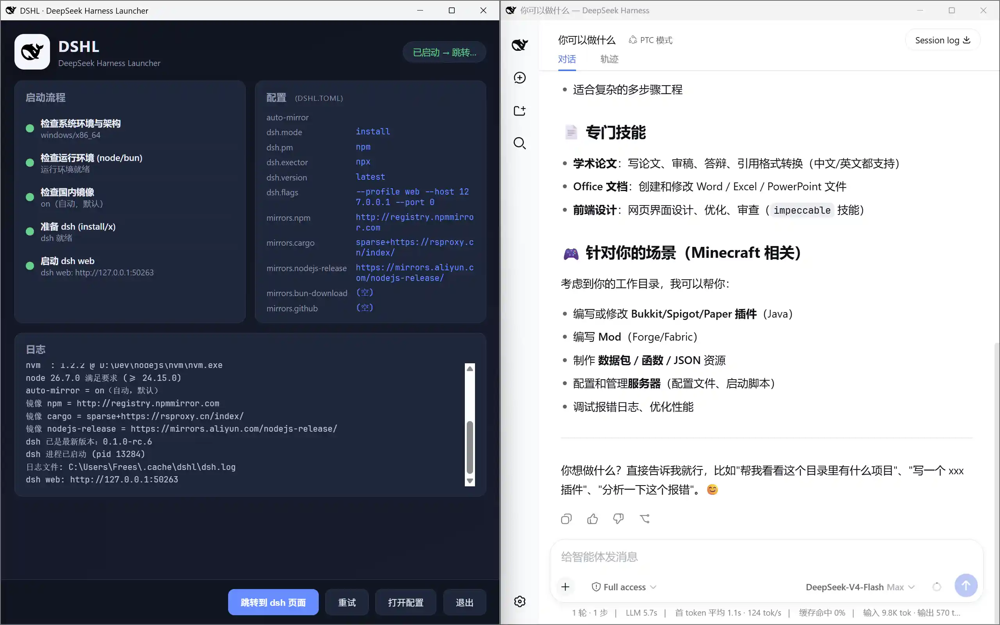

# DSHL — DeepSeek Harness 启动器

<p align="center">
  <strong>简体中文</strong> | <a href="./README_en.md">English</a>
</p>

[](https://github.com/hibays/DSHL/releases)
[](LICENSE)
[]()



DSHL 是一个轻量的原生启动器（Rust），以 [webui.me](https://webui.me) 作为启动 UI 包装，
在浏览器里启动 **DeepSeek Harness WebUI**（`dsh web`）。它会检查运行环境，必要时安装
`@deepseek-ai/dsh`，在临时端口启动它，并把浏览器路由过去。所有行为都通过 **`dshl.toml`**
配置；启动流程运行在 **tokio 多线程运行时**上（`src/runtime.rs` 的薄封装：`block_on` /
`spawn`），真异步处理子进程 I/O、定时器与保活 WebSocket。

## 双轨分发（同一套 Rust 内核）

内核是 workspace 根包 **`dshl-core`**（`src/`），两条分发轨只差入口：

- **Track A 安装器轨** — 平台原生可执行文件 `dshl`（`crates/dshl`，入口
  `main.rs → dshl_cli::run_cli()`）。
- **Track B 插件轨** — 同一内核编译成 napi-rs cdylib（`crates/dshl-native`，
  `#[napi] launch(...) → dshl_cli::run_with_options(...)`），以 `.node` 原生插件随
  [Cordis](https://cordis.js.org) 插件装进 dsh，经 FFI 在 dsh/Node 进程内运行；
  对外发布为 npm 包 `@dshl/native`（聚合六个平台子包）、`@dshl/pipe` 与
  `@dshl/control`（见下文「插件轨」）。

两个轨道共用 **`crates/dshl-cli`** 这个共享入口层（`RunOptions` / `RunOutcome` /
`RunHandle`）：Track A 解析命令行后走同一管线，Track B 跳过 CLI 解析直接以结构体
传入，并在受管后台线程上驱动管线以保证 Node 事件循环存活。

## 亮点

- **Rust 编写 · 单文件便携（Track A）** — 编译为**一个平台可执行文件**：无安装器、
  无捆绑运行时、无 GUI 框架。拷到哪都能跑（U 盘也行），`dshl.toml` 放在可执行文件旁
  （或平台配置目录）即可随身携带配置。
- **仅浏览器模式** — 启动器自己的界面不依赖任何桌面框架：启动页由内嵌的本地
  web 服务器（webui.me）提供，用系统浏览器或内嵌 WebView 作为显示端；机器上唯一的
  硬依赖是 Node.js（而 dsh 本身就需要它）。
- **五个明确的启动流程**（`src/flow/`，与启动页步骤一一对应）：
  1. `system` — 检查系统环境与架构
  2. `runtime_env` — 检查运行时（node/bun，带回退链）
  3. `mirror_check` — 国内镜像决策（`auto-mirror`）
  4. `prepare` — 准备 dsh（global/hybrid/private 模式，构建启动命令）
  5. `launch` — 启动 `dsh web` 并捕获其 URL
- **Node.js 回退链**（node 始终必需，最低 24.15.0，缺失时经 fnm 装 26）：
  `fnm` → `cargo install fnm` → `nvm` → 自动安装 fnm 到 `~/.cache/bin`
  →（全部失败时）在 UI 中给出
  [fnm 安装指南](https://www.fnmnode.com/zh-cn/guide/install)提示。
- **内嵌终端（PTY + WebSocket + xterm.js）** — Rust 侧用 `portable-pty`（Windows 为
  ConPTY，Unix 为 openpty/forkpty）持有 PTY 主从对，注入 PATH/env/cwd 后由一个
  自托管的 WebSocket 服务（绑定 `127.0.0.1:0` 随机端口、64 位 hex 令牌鉴权）把每个
  会话暴露给前端预签名 URL `ws://127.0.0.1:<port>/_pty/<id>?token=...`；xterm.js
  以静态资源形式随 `@dshl/control` 分发（白名单路由，不依赖 CDN）。见
  `src/pty/`（`spawn/list/resize/write/kill/server_endpoint`）。
- **控制面（control plane）** — 启动器开一个回环 TCP 上的 NDJSON JSON-RPC 端点，
  把原生能力（shutdown/restart/switch-profile/open-terminal/ping）暴露给被监督的
  dsh 进程；每次启动生成随机令牌并经 `DSHL_CONTROL_URL` 环境变量下发。见下文
  「控制面」。
- **窗口几何记忆** — 一个 `<cache>/dshl/window-state.json` 记录 `{x,y,width,height}`
  （物理像素），WebView 窗口与外部浏览器窗口**共享同一份**几何；所有值先经过钳制
  再交给 webui（webui 的 C 核心会静默丢弃超限值），浏览器模式按 DPI 缩放换算。
  见 `src/ui/geometry.rs`。
- **系统托盘** — Windows（隐藏消息窗口 + Shell_NotifyIconW，全走 windows-rs）、
  Linux（libayatana-appindicator3 运行时 dlopen）、macOS（tray-icon 的 AppKit 后端）
  三套实现共用同一个 6 函数接口；事件以原子标志暴露，`ui/supervisor.rs` 只轮询。
- **契约校验（插件轨）** — `@dshl/control` 用 `backend-contract.js` 按 tier
  （native 全集 / pipe 子集）校验后端能力面（warn-only 漂移检测），并以
  `resolveLaunchOptions` 白名单过滤 `launch()` 选项；guard 组件做崩溃追踪与
  回滚记账（详见「插件轨」）。
- **平台适配** — Windows（PowerShell）、Linux、macOS（bash）；dsh 以隐藏控制台 +
  新进程组启动（Windows `CREATE_NEW_CONSOLE | CREATE_NEW_PROCESS_GROUP`，Unix
  `setsid`）。Windows **release** 二进制是 GUI 程序（无控制台窗口）；dsh 已安装时
  直接执行 `dsh`（`dsh.exe`/`dsh.cmd`/`dsh.sh`）并以隐藏控制台启动。
- **应用图标** — `assets/` 只保留两份全分辨率矢量源：`dsh-black.svg`（黑色鲸鱼，
  自带深色模式适配——深色主题下自动变白）与 `dsh-white.svg`（强制白色的夜间变体）；
  其余光栅图标全部由 ffmpeg 从这两个源生成后放入 `packing/<平台>/`（见「图标」）。
- **完全可配置**的启动：包管理器、版本、flags、镜像。

## 要求

| 工具  | 版本         | 是否必需                        |
|-------|--------------|---------------------------------|
| Node  | `>= 24.15.0` | **始终**（缺失时按下方装配链安装）|
| Nub   | npm latest   | 默认（`pm = "nub"`）；缺失时经 npm 镜像装入缓存 |
| Bun   | `>= 1.3.14`  | 仅当 `pm = "bun"` 时           |
| fnm   | 任意         | 无镜像时的首选 Node 版本管理器  |
| nub   | npm latest   | 启用镜像时的首选（同时承担 pm 职责）|
| cargo | 任意         | 用于回退执行 `cargo install fnm`|
| nvm   | 任意         | 最后的受管回退                  |

## 运行时装配链

启动流水线第 2 步会先并发探测 node / bun / pnpm / nub / fnm / cargo / nvm 并把
各自的版本与路径写进日志——这一步只是透明汇报；真正的装配发生在探测结果之上，
且始终遵守同一条第一原则：**系统里已有的可用工具原样使用，绝不重装**。

node 是唯一硬前提（最低 24.15.0）。探测到已安装且满足最低版本时，其目录直接作
为运行时目录，流水线其余部分照常进行；只有缺失或过旧时才进入装配流程。此时选
择哪条路径由两个条件共同决定：配置里的包管理器是否为 nub，以及是否启用了镜像。

启用镜像且包管理器为 nub 时，装配从 npm 镜像开始：把 @nubjs/nub 安装进 dshl 自
己的缓存目录（与 pnpm 同一套机制，registry 由 mirrors.npm 注入，因此天然可镜
像），随后交由 nub 提供 node——`nub node install` 按 NODEJS_ORG_MIRROR（同样来
自 mirrors.nodejs_release）拉取发行版并放入其托管目录，`nub node which` 解析出
二进制路径，该目录随即成为本次运行的运行时目录。链条上任何一环失败都会立即回
退到下一段：fnm（无镜像环境下的首选版本管理器）→ `cargo install fnm` → nvm →
自动安装 fnm 到 `~/.cache/bin`，全部失败时界面给出 fnm 安装指南链接。

包管理器的装配遵循同样的"已有则用、缺失则装进缓存"模式：bun 缺失时经 GitHub
镜像下载本体、官方脚本兜底、npm 再兜底；pnpm 与 nub 缺失时都以
`npm install --prefix <cache>/dshl/<名字>` 落入各自缓存目录并把
`node_modules/.bin` 注入 PATH。镜像层横切以上所有网络步骤——mirrors.npm 同时喂
给 npm/bun/pnpm/nub 的 registry 与安装过程，mirrors.nodejs_release 喂给
fnm/nvm/nub 的 Node 发行版下载——且只以临时环境变量或旗标注入，从不写入任何全
局配置文件。


## 构建

```sh
cargo build --release          # 整个 workspace
cargo build --release -p dshl  # 只构建 Track A 二进制
```

二进制位于 `target/release/dshl`（Windows 为 `.exe`）。首次构建会自动编译对应平台的
WebUI C 库（webui-rs 是 git 源码依赖，无需预编译库）。

### 门禁（fmt / clippy / test / JS 检查）

门禁逻辑只有一份：`scripts/gate.sh`（POSIX）/ `scripts/gate.ps1`（PowerShell）/
`scripts/gate.bat`（cmd 转发）。CI 与本地跑的是同一条命令：

```sh
scripts/gate.sh          # 全部：cargo fmt --check + clippy -D warnings + test --workspace --locked + npm run check + npm pack 干跑
scripts/gate.sh --rust   # 仅 Rust 三项
scripts/gate.sh --js     # 仅 npm run check（node --check 语法检查）+ npm pack --workspaces --dry-run
```

PowerShell 侧等价命令为 `./scripts/gate.ps1 [-Rust|-Js]`。

### 打包（Track A）

打包步骤同样只有一份：`scripts/package.sh`（CI 按步调用，本地可端到端）：

```sh
bash scripts/package.sh all                          # 当前主机：构建 + portable zip + 平台安装器
bash scripts/package.sh stage --bin PATH_TO_BIN      # 组装 stage/（二进制 + 两份 README）
bash scripts/package.sh portable --zip NAME.zip      # stage/* + 默认 dshl.toml -> NAME.zip
bash scripts/package.sh nsis   --version V --artifact NAME   # stage/ -> dshl-<NAME>-setup.exe（需 NSIS）
bash scripts/package.sh deb    --version V --deb-arch amd64  # stage/dshl -> .deb（需 dpkg-deb）
bash scripts/package.sh dmg    --version V --artifact NAME   # stage/dshl -> dshl-<NAME>.dmg（需 macOS）
```

注意：**dshl.toml 只随 portable zip 分发**；各安装器不带配置（首次运行时启动器会
自动生成注释齐全的默认模板）。PowerShell 侧等价物为 `scripts/package.ps1`。

### 发布（npm，Track B）

```sh
node plugins/dshl-native/scripts/build-native.mjs --release  # 或 npm run build:native（本地构建宿主 .node）
scripts/publish.sh --version 0.3.0            # 版本号同步进三包 + check + pack 干跑 + 发布
scripts/publish.sh --version 0.3.0 --dry-run  # 只 bump + 校验，不发布
scripts/publish.sh                            # 按当前 package.json 版本发布
```

发布顺序固定 `@dshl/native → @dshl/pipe → @dshl/control`（control 列前两者为
optionalDependencies，必须最后发）。六个平台子包 `@dshl/native-<platform>-<arch>`
不在本地发布范围——它们只由 CI 工作流构建发布。`--provenance` 需要 OIDC，仅 CI 使用。

## CI / 发布工作流

| 工作流                       | 触发                                   | 内容 |
|------------------------------|----------------------------------------|------|
| `ci.yml`（CI）               | push 到 `main`、所有 PR                | Rust 门禁跑在 ubuntu-latest 与 windows-11-arm 双腿（gate 脚本）；JS job（Node 22）跑语法检查 + pack 干跑 |
| `release.yml`（Release · Track A） | push tag `v*`                    | 六条矩阵腿（Windows x64 / Windows ARM64 原生 runner / Linux x64 / Linux arm64 交叉 / macOS x64 / macOS arm64）：`cargo build --release --locked -p dshl` → `package.sh` 打出 portable zip + NSIS/deb/dmg，自动生成 changelog 并创建 GitHub Release |
| `release-native.yml`（Release · Track B · native .node） | push tag `v*` | 六条矩阵腿分别构建 cdylib 并发布 `@dshl/native-{win32-x64-msvc, win32-arm64-msvc, darwin-x64, darwin-arm64, linux-x64-gnu, linux-arm64-gnu}` 六个平台子包（`index.node` + 生成的 package.json，`--provenance`） |
| `release-plugins.yml`（Release · Track B · npm 聚合包）  | `workflow_run` 串联在 native 工作流成功完成后（且上游 ref 是 tag） | `bump-versions.mjs` 同步三包版本 → `npm pack` 干跑 → 按序发布 `@dshl/native`、`@dshl/pipe`、`@dshl/control` |

三个 release 工作流都有并发组保护（同名 tag 重跑会替换在途运行）。**未配置
`NPM_TOKEN` secret 时，所有 npm 发布步骤自动跳过**（输出 notice 后 exit 0，不算失败）——
fork 上跑 tag 也只会得到 Track A 制品，不会报红。

## 使用

```sh
# 使用可执行文件旁或配置目录里的配置文件
./dshl

# 指定配置文件
./dshl --config ./dshl.toml
```

完整 CLI 面：`-c/--config <path>`、`-d/--debug`（`-v/--verbose` 等价）、
`-V/--version`、`-h/--help`。

### 配置文件的搜索与生成

启动器按以下顺序查找 `dshl.toml`，**命中即用、不再继续**
（`src/config.rs::load`）：

1. `--config <path>` 显式指定（文件不存在时直接报错提示）；
2. 当前工作目录 `./dshl.toml`；
3. 可执行文件所在目录 `<exe>/dshl.toml`;
4. 平台配置目录：
   - Windows：`%APPDATA%\dshl\dshl.toml`
   - macOS：`~/Library/Application Support/dshl/dshl.toml`
   - Linux：`$XDG_CONFIG_HOME/dshl/dshl.toml`（未设置时 `~/.config/dshl/dshl.toml`）；
5. Linux 系统级配置（最低优先级）：`/etc/dshl/dshl.toml`（发行包不携带配置，需手动放置）。

全部未命中时，启动器在**平台配置目录生成默认模板**（`dshl.example.toml` 的编译期
嵌入副本，注释齐全）并使用它——因此始终存在一个真实文件可编辑，启动页的**打开配置**
按钮打开的就是它。解析失败时使用内置默认值并在启动页提示错误。

## 调试日志

`./dshl --debug`（或 `-v`、或设置非空 `DSHL_LOG`）会把完整运行时间线——每个流程
步骤和进程输出行——带单调时间戳镜像到 **stderr**（`src/debug.rs`）。debug 构建保留
控制台，所以 `cargo r -- --debug` 能实时看到；release 构建无控制台。

## 配置（`dshl.toml`）

```toml
# off = 不用镜像，on = 使用非空镜像（默认），force = 强制
auto-mirror = "on"

[mirrors]
npm            = "http://registry.npmmirror.com"     # bun 也走 npm registry
cargo          = "sparse+https://rsproxy.cn/index/"  # 临时使用，仅 CLI
nodejs-release = "https://mirrors.aliyun.com/nodejs-release/"
bun-download   = ""                                   # 空 = 不使用
github         = ""                                   # 代理前缀，如 https://ghproxy.com/

[dsh]
flags       = "--profile web --host 127.0.0.1 --port 0"
mode        = "hybrid"    # global | hybrid | private
pm          = "bun"       # npm | bun | pnpm
version     = "latest"    # "latest" = 无后缀，否则 @deepseek-ai/dsh@<version>
auto-update = true        # 自动更新 @deepseek-ai/dsh
single-instance = false   # true = 检测到其他 dsh 实例在运行时拒绝启动（防双写）

[ui]
mode    = "webview"   # webview | browser（是*偏好*，始终会回退）
close-to-tray = false # true = 关闭窗口时彻底关窗进托盘（dsh 后台运行），托盘图标重建窗口；Windows/Linux/macOS
single-instance = false # true = 只允许一个 dshl 实例；第二个实例改为激活已有实例（聚焦或唤出）
```

镜像地址为空表示**不使用**该镜像。镜像始终临时生效（环境变量 / CLI 标志），
从不写入任何全局配置。

### 模式（`dsh.mode`）

dsh 的来源：

- `global` — 严格使用 PATH 上的全局 `dsh`；缺失时直接报错（不安装）。适合自己
  管理 dsh 的用户。
- `hybrid`（默认）— 优先使用全局 `dsh`；缺失或不符合锁定的 `version` 时，把
  `@deepseek-ai/dsh` 装进 dshl 私有缓存，以 `node <入口>` 运行。绝不 `-g`。
- `private` — 始终装入 dshl 的缓存（`<cache>/dshl/node_modules`），完全不碰
  全局环境与 PATH。

### 自动更新

`auto-update`（默认 `true`）在未锁定版本（`version = "latest"`）时让
`@deepseek-ai/dsh` 保持最新：

- 在 `hybrid`/`private` 模式下，每次启动查询 registry 的最新版本，若缓存副本
  更旧则重装（最多 5 秒；离线时静默跳过）。`hybrid` 模式下仅当全局 dsh 已是最新
  时才使用它。
- `global` 模式不受 auto-update 影响——全局安装归你自己管理。

`auto-update = false` 时，启动器仅在 dsh 缺失时安装，之后不再更新。锁定的
`version`（如 `1.2.3`）始终优先，不受 `auto-update` 影响。

### 单实例（dsh 本身，可选）

默认每个 dshl 进程各自管理一个 dsh，允许多实例并存。把 `[dsh] single-instance`
设为 `true` 后，启动前会检测机器上是否已有 dsh 在运行（手动启动或由其他 dshl
启动的都会命中）；检测到则**拒绝启动**并提示，防止两个进程写同一会话日志造成
永久损坏。该检查发生在残留进程清理之后，因此自己的旧 dsh 正常退出不算冲突。

### 关闭到托盘（可选）

默认关闭窗口即退出（并优雅停止 dsh）。把 `close-to-tray` 设为 `true` 后，
dsh 已启动时关闭窗口不再退出，dsh 继续在后台运行：

- **窗口会彻底关闭**（WebView2 / WebKitGTK 进程退出，释放内存），只有
  托盘图标、启动器和 dsh 常驻；
- **托盘图标在启动时即生成**（不等第一次关窗），并随系统深浅色主题切换黑白变体；
- **Windows**：托盘图标复用窗口图标。左键**双击**或菜单「恢复窗口」**重建**
  窗口（恢复保存的几何位置）并重新导航到 dsh；单击无动作（防误触）；右键
  菜单含「打开 dsh」（系统默认浏览器打开 dsh 页面）、「退出」（与 Ctrl+C
  相同的优雅关闭路径，SIGINT 停止 dsh 并保存会话）。
- **Linux**：WebKitGTK 窗口无法拦截关闭，关闭后启动器**无窗口继续运行**，
  托盘图标（libayatana-appindicator3，运行时动态加载；桌面没有该库时
  自动降级为关闭即退出）提供「恢复窗口」（重建窗口并重新导航到 dsh）、
  「打开 dsh」和「退出」。
- **macOS**：与 Linux 相同，WKWebView 窗口关闭后启动器无窗口继续运行，
  状态栏图标（`tray-icon` 的 AppKit 后端，主线程创建）提供「恢复窗口」、
  「打开 dsh」和「退出」。图标使用 **NSImage 模板**（黑色 + alpha 遮罩），
  系统自动按菜单栏深浅色渲染，无需手动切换图标变体；左键单击直接恢复窗口，
  右键弹出菜单。

启动阶段（dsh 尚未就绪）关闭窗口仍然直接退出。

### 窗口几何记忆

无论 `webview` 还是 `browser` 后端，窗口位置和尺寸都持久化在
`<cache>/dshl/window-state.json`（物理像素），两种后端**共用同一份**——用户的布局
跟着启动器走，而不是跟着后端走。记录时机：WebView 关闭钩子、外部浏览器的 1 Hz
采样器 + 关闭时一次性补记（webui 不提供浏览器侧关闭回调）。所有恢复值先按当前屏幕
与 webui 的硬性接受范围钳制（超出范围的值会被 webui 的 C 核心静默丢弃），发给
浏览器命令行时再按 DPI 缩放换算成逻辑像素。

### 单实例（dshl 互斥，可选）

`[dsh] single-instance` 限制的是 **dsh 本身**；`[ui] single-instance` 限制
的是 **dshl 启动器**：开启后同一台机器只允许一个 dshl 进程（锁文件 + 内核
文件锁，进程崩溃自动释放，无陈旧锁问题）。第二个 dshl 启动时不会创建新
窗口，而是**激活已有实例**后退出：

- 已有实例在托盘/无窗口状态 → 唤出窗口（重建并导航回 dsh）；
- 已有实例窗口可见 → 聚焦一次（Windows 多级策略：`SetForegroundWindow` →
  输入队列关联 → 模拟 Alt 键 → `SwitchToThisWindow`；Linux 无通用窗口聚焦 API，
  仅托盘唤出）。

注意：由于第二个实例直接退出，请从启动器/快捷方式再次运行 dshl 来唤出
窗口（效果等同于“双击托盘图标”）。

## 如何启动 dsh

`dsh` 作为**受监督的子进程**启动（stdout/stderr 逐行流式写入
`<cache>/dshl/dsh.log`，同时捕获 `http://127.0.0.1:<port>` 行）。然后启动器把
启动窗口路由到该 URL，并**作为 supervisor 常驻**，因此关闭始终干净：

- **关闭显示 dsh 的窗口** → 默认杀掉 dsh 并退出启动器；`close-to-tray`
  启用时（dsh 已启动）则**进托盘**，dsh 继续后台运行。两种窗口后端都支持：
  - `webview` — 内嵌 WebView（WebView2 / WKWebView / WebKitGTK）。启动器向自己的
    webui 服务端保持一个保活 WebSocket（`multi_client`），使窗口在跳转到 dsh 后仍
    保持打开；通过 webui 的 `set_close_handler_wv`（Windows 上还有窗口句柄）检测
    关闭。进程已设为 DPI 感知（`PerMonitorV2`），高分屏下 WebView 清晰不模糊。
  - `browser` — 外部浏览器（Chrome/Edge/Firefox…）。无需保活 WebSocket：
    webui 停服时会尝试终止*外部*浏览器进程，但该进程查找是尽力而为，在现代
    Windows/Edge 上不会触发，所以浏览器跳到 dsh 后自己保持打开。启动器通过跟踪
    浏览器窗口进程并轮询其退出来检测关闭，`close-to-tray` 时同样进托盘（恢复时
    重新打开浏览器）。
- dsh **正常退出**（exit 0，例如 Ctrl+C 后自存的优雅关闭）→ 启动器也随之退出。
- dsh **成功启动后意外退出**（非零退出码 / 被信号杀死）→ **崩溃恢复**：窗口跳回
  启动页，显示「dsh 意外退出（exit N）」横幅并**倒计时 5 秒**自动重启（立即重启 /
  取消）；超时或点「立即重启」即重新走一遍完整启动流程并跳回 dsh 页；点「取消」则
  停在启动页，可手动「重试」或退出。窗口在托盘时崩溃也会先唤出窗口再倒计时。
- Ctrl+C / SIGTERM → 杀掉 dsh 后退出。
- dsh 会被**优雅停止**（Windows 通过隐藏控制台 + `GenerateConsoleCtrlEvent` 发
  Ctrl+C，Unix 发 SIGTERM），等待其自行退出（重试路径 10 秒 / 退出路径 30 秒
  宽限）。**从不自动强杀**：宽限超时后本次启动取消，由用户在启动页确认后才会
  「强制结束残留进程」（`taskkill /F /T` / `SIGKILL`），防止双进程写同一 session
  日志造成永久损坏。
- 启动器被强杀（Windows `TerminateProcess`）→ dsh 由 kill-on-close
  **Job Object** 回收（Linux 用 `PR_SET_PDEATHSIG`）。
- 启动前关闭启动窗口，或点 **退出** 按钮 → 优雅停止 dsh（Ctrl+C/SIGTERM）后退出。

## 控制面（control plane）

`src/control.rs` 实现了 `@dshl/control` 插件契约的 Rust 一端：一个回环 TCP 上的
NDJSON 端点，把启动器的原生能力暴露给被监督的 dsh 进程。

- **握手**：客户端先发 `{"type":"hello","token":"<per-launch token>"}`（5 秒超时），
  之后交换 `request/response` 帧（单帧上限 64 KiB）。
- **令牌**：每次启动从平台 CSPRNG 生成（UUID v4，122 位熵），经环境变量
  `DSHL_CONTROL_URL`（格式 `dshl://<token>@127.0.0.1:<port>`）下发给 dsh；
  日志中只出现端口、从不出现令牌。
- **方法集**：`ping`（pong + 版本）、`shutdown`（请求优雅关闭）、
  `switch-profile`（持久化待选 profile 后触发重启，下次启动生效）、
  `open-terminal`（以最近一次 dsh 启动的增强 PATH 打开终端）、`restart`
  （重走完整启动管线）；未知方法返回错误帧。
- **启用**：CLI 入口默认开启（`RunOptions.enable_control_pipe` 可关，供嵌入
  宿主自行决定）。

## 插件轨（npm 包）

`plugins/` 下三个 npm 包组成 Track B（monorepo 由根 `package.json` workspaces 管理，
要求 Node ≥ 22）：

- **`@dshl/native`** — napi 加载器。优先加载本地构建的宿主 `.node`
  （`npm run build:native`），否则按平台解析六个 CI 发布的
  `@dshl/native-<platform>-<arch>` 子包（optionalDependencies）。
- **`@dshl/pipe`** — 远程控制管道后端：读取 `DSHL_CONTROL_URL` 连接正在运行的
  dshl 控制面（REMOTE tier，无窗口/托盘/终端能力）。
- **`@dshl/control`** — 聚合消费方。以 Cordis 的可选缝习得后端
  （`ctx.get('dshlNativeBackend') ?? null`——提供方未加载即 undefined，绝不
  `require()` 绕过容器），把在场后端折叠成 `nativeCapabilities` 服务，并在 dsh 的
  web server 上注册一组**仅回环可用**（校验 remoteAddress 与 Host 头）的 HTTP 路由：
  状态、window show/hide/navigate、tray、launch、guard 管理与终端控制。
  - `window/show` 在启动器尚在引导期返回 **409 `{ code: 'booting' }`**，让 UI
    如实本地化而不是假装成功；
  - `/dshl-control/launch` 用 `resolveLaunchOptions` **白名单**透传选项——只有
    文档化的 `LaunchOptions` 键（`config/debug/enableSingleInstance/
    enableControlPipe/installSignalHandler`）能通过，snake_case 拼写错误不会被
    napi 静默吞掉；
  - xterm.js 资源以**固定白名单**路由提供（vendored 于 `assets/xterm`，无 CDN 依赖，
    无路径遍历面）。
- **backend-contract.js（契约校验）** — 定义 native / pipe 两个 tier 各自必须
  暴露的能力组；`checkBackend(tier, backend)` 做 warn-only 漂移检测（缺方法只是
  把对应路由降级为 501，不拖垮整个桥）。
- **plugin-guard.js（禁用守卫 + 崩溃回滚）** — 在 `$DSH_HOME/.dshl/`（回退
  `~/.dsh/.dshl/`）持久化 `disabled.json` 与 `launch-state.json`：
  `beginStartup` 记录 startedAt 并置 healthy=false；渲染端须在 30 秒窗口内调
  `markHealthy`（HTTP `POST /dshl-control/plugins/mark-healthy`）；插件 dispose
  钩子**自动调用 `markShutdown`**——正常停机不计为崩溃。下一次启动时若上一轮
  既非 healthy 又非优雅退出（超过 10 秒宽限），计一次连续崩溃，并把当前存在而
  上次健康快照中没有的 bundle 标记为可疑；连续 3 次即把可疑 bundle 写入
  disabled.json（reason `crash-3x`）。
  注意（如实声明）：目前 dsh 的插件加载器并不读取 disabled.json——禁用清单是
  **记账 + 可视化**（服务与 HTTP 路由均暴露），不是加载期拦截。

## 项目结构

以下树按 `git ls-files` 实际内容绘制：

```
Cargo.toml             workspace 根（dshl-core 内核包 + 三个成员 crate）
package.json           monorepo：三个 @dshl/* npm 包的 workspaces 与脚本
dshl.example.toml      注释齐全的默认配置模板（编译期嵌入，缺失时自动生成）
assets/                启动页（index.html / app.js / styles.css）
                       + 全分辨率图标矢量源（dsh-black.svg / dsh-white.svg）
locales/               i18n 翻译（en.yml / zh-CN.yml，编译期嵌入，zh-CN 兜底）
docs/                  截图
packing/               平台安装器素材与生成的光栅图标
  windows/               dshl.nsi + dsh.ico / dsh-white.ico
  linux/                 build-deb.sh + dsh*.png（256/512px）
  macos/                 build-dmg.sh + dsh*.png + tray-black.rgba（32×32 状态栏模板，原始 RGBA）
scripts/               gate.{sh,ps1,bat} 门禁；package.{sh,ps1} 打包；publish.{sh,ps1} npm 发布；bump-versions.mjs
.github/workflows/     ci.yml；release.yml（Track A）；release-native.yml；release-plugins.yml

src/                   dshl-core 内核（lib.rs 注册模块）
  lib.rs                模块注册表 + DSH_CHILD 全局
  runtime.rs            tokio 多线程运行时的薄封装（block_on / spawn）
  config.rs             dshl.toml 模型 + 发现 + 默认模板生成
  control.rs            控制面（回环 TCP NDJSON RPC，见上文）
  error.rs              极简错误类型（Error(String) + bail! 宏 + Result 别名）
  i18n.rs               locale 探测 + t! 翻译初始化
  mirror.rs             镜像解析（临时，从不持久化）
  probe.rs              工具探测（node/bun/fnm/cargo/nvm/dsh）
  progress.rs           共享状态（与 UI 解耦）
  version.rs            语义化版本解析/比较
  wskeep.rs             保活 WebSocket（让 WebView 窗口保持打开）
  debug.rs              stderr 时间线日志（--debug / DSHL_LOG）
  testutil.rs           测试辅助（按平台选 shell 的测试命令构造）
  flow/                 五个启动流程（system / runtime_env / mirror_check / prepare / launch）
  install/              运行时安装器 + 回退链（node/bun/pnpm/download/stream/runtime）
  platform/             OS 原语（detect/paths/actions/process/dpi/theme/window/single_instance）
  process/              进程助手（capture/child/win_proc/win_job）
  pty/                  内嵌 PTY 服务 + 自托管 WS 服务器（server/session/types）
  tray/                 系统托盘（windows/linux/macos，共用 6 函数接口）
  ui/                   webui.me 启动窗口（state/bindings/window/launch/supervisor/vfs/exit/crash/geometry/assets）

crates/
  dshl/                 Track A 二进制（main.rs + build.rs 内嵌 .exe 图标资源）
  dshl-cli/             共享入口层（options/handle/run/signal/control shims）
  dshl-native/          Track B napi-rs cdylib（kernel/platform/pty/tray/window/supervisor/types）

plugins/
  dshl-native/          @dshl/native —— napi 加载器 + build-native.mjs
  dshl-pipe/            @dshl/pipe —— 远程控制管道后端（client/index）
  dshl-control/         @dshl/control —— 聚合消费方（index/ui/plugin-guard/backend-contract
                        + vendored xterm.js 资产）
```

### 架构说明（松耦合设计）

- **`platform/` 只做 OS 原语**：检测、路径、进程、DPI、主题、窗口助手、单实例
  互斥。每个子模块一个职责，`mod.rs` 是薄门面（re-export），其余代码的
  `crate::platform::…` 调用不变。
- **Windows API 全部走 `windows-rs 0.62`**：不再有手写 `#[link] extern "system"`
  FFI 块；需要哪个模块就开哪个 feature。
- **`tray/` 与 UI 解耦**：三套平台实现共用同一个 6 函数接口（`start` /
  `hide_to_tray` / `quit_requested` / `restore_requested` / `set_icon` /
  `shutdown`），事件都以原子标志的形式暴露，`ui/supervisor.rs` 只轮询标志。
  macOS 因 AppKit 必须主线程创建状态栏图标，`start()` 只记意图，真正创建推迟到
  主线程轮询时。
- **`ui/` 按职责拆分**：全部共享状态集中在 `state.rs`（模块间不互相摸内部），
  `window.rs` 管窗口本身（含几何持久化），`launch.rs` 管启动流程，
  `supervisor.rs` 管事件循环，`bindings.rs` 是页面的唯一入口，`mod.rs` 只做
  re-export 门面（`setup` / `launch_flow` / `run_loop` / `request_shutdown` 等）。
- **`process/` 按职责拆分**：`capture.rs` 管同步捕获与命令准备，`child.rs` 管
  `AsyncChild` 流式行队列与优雅停止，Windows 专属的隐藏控制台 spawn / Ctrl+C
  （`win_proc.rs`）和 kill-on-close Job Object（`win_job.rs`）单独成文件。
- **`install/` 按运行时拆分**：node / bun / pnpm 三个安装器各占一个文件，公共的
  zip 下载、fnm 二进制下载、github 代理前缀在 `download.rs`，`Runtime` 模型与
  `run_streaming` 各自独立。
- **错误处理**：`error.rs` 提供零依赖的 `Error(String)`、`bail!` 宏与 `Result`
  别名，跨模块统一使用。
- **i18n**：`rust-i18n` 编译期嵌入 `locales/`，`t!` 宏全 crate 可用，zh-CN 为
  兜底语言；默认 locale 由 OS UI 语言探测（`sys-locale`）决定。
- **测试基建**：`testutil.rs` 提供 `shell(win_cmd, unix_cmd)`——按目标平台选择
  `%COMSPEC% /c` 或 `sh -c` 构造子进程测试命令，替代过去逐文件复制的 COMSPEC
  写法（避免 WSL interop 下误选）。

## 图标

`assets/` 下只有两份**全分辨率矢量源**（1024×1024 声明尺寸，向量渲染，缩放不糊）：

- `dsh-black.svg` — 黑色鲸鱼；自带 `prefers-color-scheme: dark` 适配，页面/标签页
  图标在深色主题下自动变白。
- `dsh-white.svg` — 强制白色的夜间变体（深色任务栏/窗口/托盘图标）。

其余所有图标都由 ffmpeg（librsvg）从这两个源生成，生成后放入 `packing/<平台>/`：

```sh
# Windows 多尺寸 .ico（16/32/48/64/128/256）——黑色默认 / 白色夜间
ffmpeg -hide_banner -y -i assets/dsh-black.svg \
  -filter_complex "split=6[a][b][c][d][e][f];[a]scale=16:16:flags=lanczos[b];\
[b]scale=32:32:flags=lanczos[c];[c]scale=48:48:flags=lanczos[d];\
[d]scale=64:64:flags=lanczos[e];[e]scale=128:128:flags=lanczos[f];\
[f]scale=256:256:flags=lanczos[g]" \
  -map "[b]" -map "[c]" -map "[d]" -map "[e]" -map "[f]" -map "[g]" \
  -c:v bmp packing/windows/dsh.ico
# 白色变体：输入换 assets/dsh-white.svg → packing/windows/dsh-white.ico

# Linux PNG（256/512px）与 macOS PNG（1024px，打包时用 sips+iconutil 生成 .icns）
ffmpeg -hide_banner -y -i assets/dsh-black.svg -vf "scale=256:256:flags=lanczos" -frames:v 1 packing/linux/dsh.png
ffmpeg -hide_banner -y -i assets/dsh-black.svg -vf "scale=512:512:flags=lanczos" -frames:v 1 packing/linux/dsh-512.png
ffmpeg -hide_banner -y -i assets/dsh-black.svg -frames:v 1 packing/macos/dsh.png
# 白色变体把输入换为 assets/dsh-white.svg，输出 dsh-white*.png

# macOS 状态栏模板图标（32×32 原始 RGBA，编译期嵌入；黑色 + alpha 遮罩，
# 系统自动按菜单栏深浅色渲染）
ffmpeg -hide_banner -y -i assets/dsh-black.svg -pix_fmt rgba -f rawvideo -s 32x32 packing/macos/tray-black.rgba
```

> **⚠️ 免责声明**
> 本工具（DSHL）是一个**社区第三方启动器**，与 DeepSeek（深度求索）官方**无任何直接或间接的关联、授权或认可**。
> 项目内所有提及的商标（包括“DeepSeek”、“DeepSeek Harness”等）均属于其各自的合法所有者。

## License

MIT.
